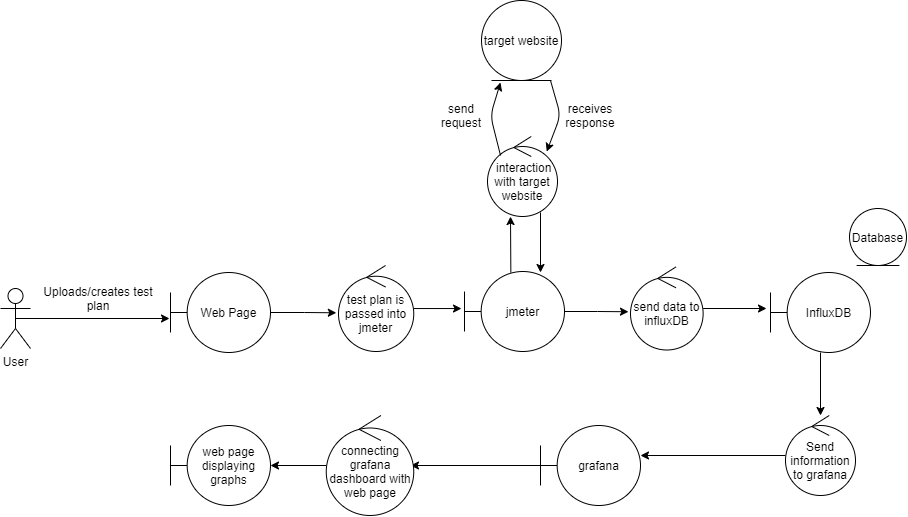

# Documentation Images

## System Diagram
### (firstDiagram)

### (systemDiagram)

## Robustness Diagrams
### (v1)

### (v2)

## Use-Case Diagrams
### (v1)

<a class="btnfire small stroke"><em class="fas fa-chevron-circle-down"></em>&nbsp;&nbsp;Expand</a

 

